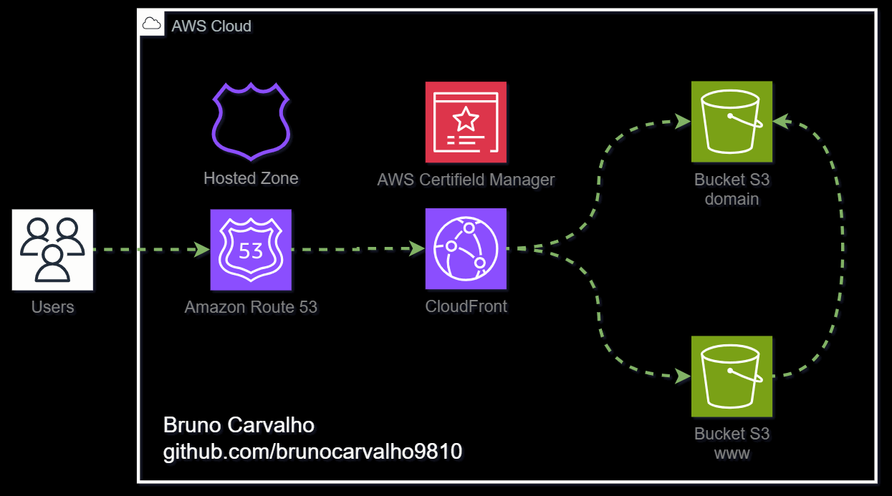

<h1 align="center">Implantação de Website Estático com Terraform </h1>

<h2>Pré-requisitos</h2>

Antes de executar o Terraform, certifique-se de ter o seguinte:

<ol>
  <li>Conta AWS com as permissões adequadas</li>
  <li>Nome de domínio registrado, seja com o AWS Route 53 ou outro provedor DNS</li>
  <li>Terraform instalado em sua máquina</li>
</ol>

<h2>Instruções de Configuração</h2>

<ol>
  <li><strong>Criar Bucket de Backend do Terraform:</strong>
    <ul>
      <li>Crie um bucket S3 para armazenar o arquivo de estado do Terraform (`terraform.tfstate`).</li>
      <li>Atualize o arquivo `backend.hcl` com o nome do seu bucket.</li>
    </ul>
  </li>
  <li><strong>Inicializar o Terraform:</strong>
    <ul>
      <li>Execute `terraform init` no diretório `terraform` para inicializar o Terraform.</li>
    </ul>
  </li>
  <li><strong>Configurar DNS:</strong>
    <ul>
      <li>Se seu domínio estiver registrado no AWS Route 53, pule esta etapa.</li>
      <li>Se seu domínio estiver registrado em outro provedor, crie uma Zona Hospedada no Route 53 com o nome do seu domínio.</li>
      <li>Atualize as configurações do seu provedor DNS para apontar para os servidores de nomes do AWS Route 53.</li>
    </ul>
  </li>
  <li><strong>Implantar Website Estático:</strong>
    <ul>
      <li>Atualize o diretório `my-website` com os arquivos do seu website estático.</li>
      <li> Utilize os comando "npm ci" e "npm run build" para fazer o build da aplicação dentro da pasta my-website</li>
      <li>Execute `terraform apply -var="domain=seu-domínio"` para implantar o website, substituindo `seu-domínio` pelo nome do domínio desejado.</li>
      Obs: Para ajudar na automatização do deploy utilize o script chamado deploy.sh na pasta ./scripts passando como parametro seu dominio -> "./deploy.sh seu-dominio"
    </ul>
  </li>
  <li><strong>Acessar o Website:</strong>
    <ul>
      <li>Após a conclusão da implantação do Terraform, seu website deve ser acessível pelo seu nome de domínio.</li>
    </ul>
  </li>
</ol>

<h2>Informações Adicionais</h2>

<ul>
  <li><strong>CloudFront CDN:</strong> O CloudFront é usado para armazenar em cache e servir o conteúdo do seu website globalmente, melhorando o desempenho e reduzindo a latência.</li>
  <li><strong>Certificado SSL:</strong> O AWS Certificate Manager fornece certificados SSL para conexões HTTPS seguras com seu website.</li>
  <li><strong>Logs:</strong> Os logs de acesso ao seu website são armazenados em um bucket S3 separado (`seu-domínio-logs`).</li>
  <li><strong>Redirecionamento:</strong> O bucket `www.seu-domínio` é usado para redirecionar solicitações do subdomínio `www` para o bucket principal (`seu-domínio`).</li>
</ul>

Sinta-se à vontade para entrar em contato se tiver alguma dúvida ou precisar de mais assistência!

---
 

<h1 align="center">Static Website Deployment with Terraform </h1>

<h2>Prerequisites</h2>

Before running Terraform, make sure you have the following:

<ol>
  <li>AWS account with appropriate permissions</li>
  <li>Domain name registered, either with AWS Route 53 or another DNS provider</li>
  <li>Terraform installed on your machine</li>
</ol>

<h2>Setup Instructions</h2>

<ol>
  <li><strong>Create Terraform Backend Bucket:</strong>
    <ul>
      <li>Create an S3 bucket to store the Terraform state file (`terraform.tfstate`).</li>
      <li>Update the `backend.hcl` file with your bucket name.</li>
    </ul>
  </li>
  <li><strong>Initialize Terraform:</strong>
    <ul>
      <li>Run `terraform init` in the `terraform` directory to initialize Terraform.</li>
    </ul>
  </li>
  <li><strong>Configure DNS:</strong>
    <ul>
      <li>If your domain is registered with AWS Route 53, skip this step.</li>
      <li>If your domain is registered with another provider, create a Hosted Zone in Route 53 with your domain name.</li>
      <li>Update your DNS provider's settings to point to AWS Route 53 name servers.</li>
    </ul>
  </li>
  <li><strong>Deploy Static Website:</strong>
    <ul>
      <li>Update the `my-website` directory with your static website files.</li>
      <li>Use the "npm ci" and "npm run build" commands to build the application inside the my-website folder</li>
      <li>Run `terraform apply -var="domain=your-domain"` to deploy the website, replacing `your-domain` with your desired domain name.</li>
      Note: To help automate deployment, use the script called deploy.sh in the ./scripts folder, passing your domain as a parameter -> "./deploy.sh your-domain"
    </ul>
  </li>
  <li><strong>Access the Website:</strong>
    <ul>
      <li>Once Terraform completes deployment, your website should be accessible via your domain name.</li>
    </ul>
  </li>
</ol>

<h2>Additional Information</h2>

<ul>
  <li><strong>CloudFront CDN:</strong> CloudFront is used to cache and serve your website content globally, improving performance and reducing latency.</li>
  <li><strong>SSL Certificate:</strong> The AWS Certificate Manager provides SSL certificates for secure HTTPS connections to your website.</li>
  <li><strong>Logging:</strong> Logs for your website access are stored in a separate S3 bucket (`your-domain-logs`).</li>
  <li><strong>Redirection:</strong> The `www.your-domain` bucket is used for redirecting requests from the `www` subdomain to the main bucket (`your-domain`).</li>
</ul>

Feel free to reach out if you have any questions or need further assistance!

